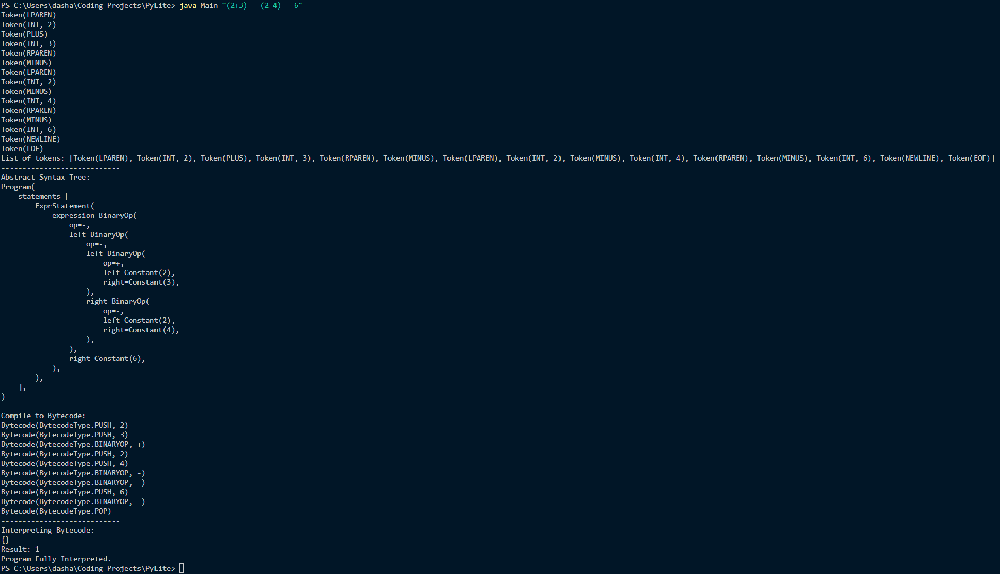

**Project Title: Java-based Python Interpreter**


**Description:**
This project implements a simple Intepreter and compiler build in Java for a subset of the Python programming language in. The compiler translates source code written in the Python subset into bytecode instructions that can be executed by the interpreter.


**Features:**
Can Only Currently Support complex addition, substraction, exponentiation and simple boolean expressions 


**Components:**
1. **Lexer:** Tokenizes the source code into tokens for parsing.
2. **Parser:** Parses the source code into an abstract syntax tree (AST).
3. **Compiler:** Converts the AST into bytecode instructions.
5. **Interpreter:** Executes the bytecode instructions.

**Usage:**
1. **Compilation:**
   - Ensure that Java is installed on your system.
   - Compile the source code using the Java compiler (Javac):
     ```
     javac *.java
     ```
2. **Execution:**
   - Run the compiled Main class with python code:
     ```
     java Main "<python code>"
     ```
   - The compiler will read the source code, parse it, generate bytecode instructions, and print them to the console.

**Sample Code:**
Suppose we have the following source code in `<python code>`:
```python
(2+3) - (2-4) - 6
```
We can compile and execute it as follows:
```
java Compiler "<python code>"
```
**Output**
Here is the overview of the out put of `(2+3) - (2-4) - 6`


**Contributors:**
- Dasharn

The following are things I need to complete over time.

**TODO:**
- [ ] Fix errors in the code introduced from trying to add support for if.
- [ ] Fix errors in the code variable assignment
- [ ] Add Support for comparison operators ==, !=, <, <=, >, >=.
- [ ] Add support for more complex Boolean expressions
- [ ] Add Support for chained comparisons.
- [ ] Add support for the elif and else statements
- [ ] Add support for conditional expressions
- [ ] Add support for the while loop.
- [ ] Add support for break and continue
